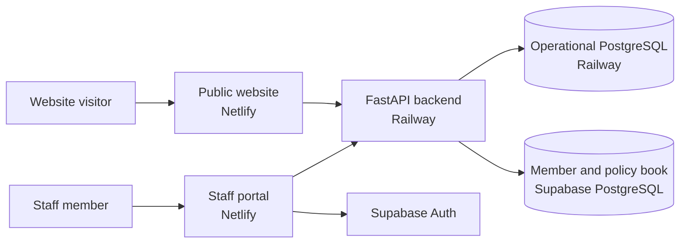

# Railway backend deployment plan

Prepared for Induduzo Funeral Home on 16 September 2026.

This is the deployment plan for making the public registration flow operational.
It describes the current system, the recommended production layout, the work
required before deployment, the Railway settings, verification, monitoring and
rollback. It does not deploy anything by itself.

## The result we want

After this work:

1. `https://induduzo.co.za` remains the public Netlify website.
2. The registration form sends requests to `https://api.induduzo.co.za`.
3. Railway runs the Python/FastAPI API continuously.
4. New enquiries are stored in hosted PostgreSQL rather than the laptop's Docker
   database.
5. Staff continue signing in through Supabase Auth.
6. The staff portal reads the imported member and policy book from Supabase and
   reads new enquiries from the API database.

## Current system, in plain language



There are two PostgreSQL roles in the architecture:

| Data | Present location | Production recommendation |
|---|---|---|
| Website enquiries, enquiry events, staff authorization and staff audit events | Local Docker Postgres | Railway Postgres |
| Imported people, policy members and policies | Supabase Postgres | Keep in Supabase for this launch |
| Staff passwords and sessions | Supabase Auth | Keep in Supabase Auth |

Supabase includes PostgreSQL, but the project currently also uses a separate
ordinary PostgreSQL database. The local Docker database is only a development
database. Railway cannot connect to `localhost` on this computer, and this
computer must not become a production server.

The current cloud Supabase database contains the imported member book. It does
not contain the complete operational schema used by the enquiry API and staff
authorization. Combining both databases is possible later, but doing that as
part of the first API deployment adds a data migration and access-control change
to an otherwise straightforward launch.

## Recommended Railway project

Create one Railway project named `induduzo-production` with these services:

| Railway service | Purpose | Public? | Runs continuously? |
|---|---|---:|---:|
| `api` | FastAPI application | Yes | Yes |
| `postgres` | Enquiries and staff authorization | No | Yes |
| `database-migrator` | Applies schema changes and provisions the restricted API role | No | Only when a migration is required |

Use **EU West (Amsterdam)** for the API and Railway Postgres. Railway currently
offers US West, US East, EU West and Southeast Asia; EU West is the closest
available region to South Africa. See [Railway regions](https://docs.railway.com/deployments/regions).

Keep the API and Railway Postgres in the same Railway project and environment so
they communicate over Railway's private network. Railway Postgres is private by
default and exposes `DATABASE_URL` to other services. Do not enable its public
TCP proxy for normal application traffic. See [Railway PostgreSQL](https://docs.railway.com/databases/postgresql)
and [Railway private-network guidance](https://docs.railway.com/overview/best-practices).

## What “always running” means on Railway

For this production API:

- Use a paid Railway plan. Hobby currently costs **$5 per month and includes $5
  of resource usage**; usage above that is billed separately. Pro is $20 per
  month and is aimed at production teams. See [Railway pricing](https://docs.railway.com/pricing).
- Leave **Serverless disabled**. Serverless deliberately sleeps an inactive
  service and its first wake-up request can return `502`. See [Railway Serverless](https://docs.railway.com/deployments/serverless).
- Set **Restart Policy = Always**. Railway's paid plans can restart the service
  without the ten-retry limit applied to free/trial services. See [restart policies](https://docs.railway.com/deployments/restart-policy).
- Start with one API replica. Add a second replica later if the business needs
  continued service through a single-container failure.
- Add an external uptime monitor. Railway's configured health check is used
  during deployment; Railway explicitly says it is not continuous production
  monitoring. See [Railway health checks](https://docs.railway.com/deployments/healthchecks).

“Always” reduces avoidable downtime; it is not an absolute guarantee. Railway,
DNS, Netlify and the database can still have incidents. Two API replicas,
database high availability and a tested recovery procedure are later reliability
upgrades.

## Repository work before deployment

Items 1–4 were completed on 8 October 2026 on branch `feat/railway-readiness`
and verified locally against a throwaway Postgres 17. Item 5 is what remains.

### 1. The backend image — done

`Dockerfile.backend` at the repository root builds a Python 3.12 image holding
only `backend/app`, the migration runner, `db/provision_api_role.py` and the
migrations. `.dockerignore` denies everything else by default, so no `.env`
file or import spreadsheet can reach an image layer. It runs as a non-root user
and starts with:

```sh
exec uvicorn backend.app.main:app --host 0.0.0.0 --port "${PORT:-8000}"
```

Railway injects `PORT`; nothing hard-codes it. `exec` makes Uvicorn PID 1, so
Railway's stop signal reaches it (a local stop completes in about a second).
An explicit Dockerfile stops Railway auto-detecting one of the two Vite apps
instead. See [Railway build configuration](https://docs.railway.com/builds/build-configuration).

### 2. The health check fails when the database does — done

`/health` now returns **HTTP 503** with `"database": "down"` when the database
cannot be reached, and 200 only when it can. Railway and uptime monitors treat
any `2xx` as healthy, so a new deployment that cannot save registrations no
longer receives traffic. One endpoint serves both purposes: use `/health` for
Railway's deploy check and for the external monitor.

### 3. Production database provisioning — done

```sh
python db/provision_api_role.py
```

Reads `DATABASE_OWNER_URL` and `API_DB_PASSWORD` (at least 32 URL-safe
characters). It applies pending migrations through `db/migrate.py`, refuses to
continue if `induduzo_api` is a superuser or bypasses RLS, gives the role login
with that password, then connects **as** `induduzo_api` to prove it works. It is
safe to re-run. It never prints a connection string or the password, and the
password reaches Postgres only as a SCRAM hash, computed client-side the way
psql's `\password` does, so it cannot appear in a server log.

The `api` service receives only the restricted `induduzo_api` connection
string, because the owner bypasses row-level security and can alter or delete
the schema.

The first Railway run applies the complete schema. The member and policy tables
it creates in Railway will be empty; the portal's member routes keep reading the
imported records from Supabase. That is expected for this first deployment.

### 4. Backend behaviour checks in CI — done

`.github/workflows/quality-checks.yml` gains two jobs:

- **API behaviour** starts Postgres 17, runs `db/provision_api_role.py`, then
  runs `backend/tests/` with pytest **as `induduzo_api`**, so grants and RLS
  are exercised exactly as in production. It checks that `/health` is 200 or 503
  with the database up or down; that stage one writes one row and one
  `lead_captured` event; that stage two promotes that same row, not a second
  one; that invalid input is 422 and writes nothing; and that every staff route
  returns 401 without a token. The staff routes are discovered from the app,
  so a route added later is checked automatically.
- **Build the API image** builds `Dockerfile.backend` and imports the app inside
  it, so a broken image fails CI rather than a release.

Run the checks locally against a throwaway database:

```sh
cd backend
pip install -r requirements.txt -r requirements-dev.txt
DATABASE_URL=postgresql://induduzo_api:<password>@localhost:<port>/<db> python -m pytest
```

### 5. Commit and push the exact release

Railway's GitHub integration deploys pushed commits, not the uncommitted files
on this computer. Follow the repository's promotion path:

```text
feature branch -> Dev -> internal -> main
```

Use `main` as the production Railway source branch after the internal checks
pass.

## Railway setup sequence

### Step 1: Create the project and production environment

1. Create `induduzo-production` in Railway.
2. Choose a paid plan.
3. Set the project region to EU West.
4. Keep the default production environment; add staging later rather than
   sharing production data with preview deployments.
5. Set a usage email alert. Be careful with a hard usage limit: Railway stops
   workloads when the limit is reached, which conflicts with the goal of an
   always-available API. See [Railway cost controls](https://docs.railway.com/pricing/cost-control).

### Step 2: Add Railway Postgres

1. On the project canvas select **New -> Database -> PostgreSQL**.
2. Name the service `postgres`.
3. Keep it private. Do not generate a public TCP endpoint for normal use.
4. Confirm its region is EU West.
5. In **Backups**, enable daily and weekly volume backups.
6. Before launch, create a manual backup and perform a restore drill.

Railway's database templates are services you remain responsible for operating,
including backups and monitoring. Railway documents volume snapshots, point-in-time
recovery and portable `pg_dump` backups in its [Postgres backup and restore guide](https://docs.railway.com/guides/postgres-backups-restores).

### Step 3: Run the database migrator

Create a private service from the same GitHub repository:

- **Name:** `database-migrator`
- **Source branch:** the release commit being deployed
- **Root directory:** `/`
- **Dockerfile path:** `/Dockerfile.backend`
- **Public domain:** none
- **Restart policy:** Never
- **Owner connection variable:**
  `DATABASE_OWNER_URL=${{postgres.DATABASE_URL}}`
- **API password:** `API_DB_PASSWORD=${{shared.API_DB_PASSWORD}}`, the sealed
  shared variable described in Step 5 (at least 32 URL-safe characters)
- **Start command:** `python db/provision_api_role.py`

Run this service once. Its log should list migration filenames and a successful
completion, without printing credentials. Then verify the migration status.

Railway reference variables use `${{SERVICE_NAME.VARIABLE}}` syntax and stay in
sync when service credentials change. See [Railway variables](https://docs.railway.com/variables).

### Step 4: Create the API service

Create a second service from the repository:

- **Name:** `api`
- **Source:** the GitHub repository
- **Branch:** `main`
- **Root directory:** `/`
- **Dockerfile path:** `/Dockerfile.backend`
- **Watch paths:** `/backend/**`, `/db/**`, `/Dockerfile.backend`
- **Region:** EU West
- **Replicas:** 1 initially
- **Serverless:** disabled
- **Restart policy:** Always
- **Health-check path:** `/health`
- **Health-check timeout:** 300 seconds

Railway supports monorepo root directories and watch paths so frontend-only
commits do not rebuild the API. See [Railway monorepo deployments](https://docs.railway.com/deployments/monorepo).

Do not add a volume to the API. It is stateless; persistent data belongs in
PostgreSQL.

### Step 5: Configure API variables

Set these on the `api` service. Seal secret values after confirming them.

| Variable | Production value or source | Required for sign-ups? |
|---|---|---:|
| `DATABASE_URL` | Restricted `induduzo_api` URL using the private Postgres host | Yes |
| `ENVIRONMENT` | `production` | Yes |
| `CORS_ORIGINS` | `https://induduzo.co.za,https://portal.induduzo.co.za` | Yes |
| `SUPABASE_URL` | Current Induduzo Supabase project URL | Staff portal |
| `SUPABASE_PUBLISHABLE_KEY` | Current Supabase publishable key | Member book in portal |
| `STAFF_EMAILS` | Bootstrap owner address | First staff setup |
| `SUPABASE_SERVICE_ROLE_KEY` | Supabase server-side secret | Optional; automated staff invites |
| `SMTP_HOST`, `SMTP_PORT`, `SMTP_USERNAME`, `SMTP_PASSWORD` | Business mailbox provider | Optional for saving; required for notification email |
| `MAIL_FROM`, `MAIL_TO` | Business addresses | Notification email |
| `TWILIO_ACCOUNT_SID`, `TWILIO_AUTH_TOKEN`, `TWILIO_WHATSAPP_FROM`, `TWILIO_CONTENT_SID` | Twilio | Optional for saving; required for WhatsApp confirmation |
| `SENTRY_DSN` | Sentry project DSN | Recommended |
| `SENTRY_TRACES_SAMPLE_RATE` | `0.1` initially | Recommended |

Create a shared, sealed `API_DB_PASSWORD` containing a long URL-safe generated
password. After the migrator applies that password to the database role, the
restricted connection can be assembled with Railway references:

```text
DATABASE_URL=postgresql://induduzo_api:${{shared.API_DB_PASSWORD}}@${{postgres.PGHOST}}:${{postgres.PGPORT}}/${{postgres.PGDATABASE}}
```

Do not define `PORT`; Railway supplies it. `RELEASE` may also remain unset
because the code falls back to Railway's `RAILWAY_GIT_COMMIT_SHA`.

Do not copy the local `.env` file into Railway. Add values through Railway's
Variables screen. Never place production credentials in a committed `.env`,
Dockerfile, start command or deployment log.

### Step 6: Generate a temporary Railway domain

In the API service's **Settings -> Networking**, generate a Railway domain.
Test the API there before changing DNS:

```sh
curl https://REPLACE.up.railway.app/health
```

Expected production response includes:

```json
{
  "status": "ok",
  "environment": "production",
  "database": "up"
}
```

Interactive `/docs` should return `404` in production because
`ENVIRONMENT=production` disables it.

### Step 7: Add `api.induduzo.co.za`

Add `api.induduzo.co.za` as a custom domain on the Railway API service. Railway
will provide a CNAME record and a TXT verification record; both are required.

The repository's current domain notes say the live DNS zone is managed in
Netlify DNS. Add Railway's records in **Netlify -> Domains -> induduzo.co.za ->
DNS records**, rather than at the domain registrar. Keep the Railway-provided
domain until the custom domain is verified and its certificate is active.

Railway automatically issues and renews TLS certificates for verified custom
domains. See [Railway custom domains](https://docs.railway.com/networking/domains/working-with-domains).

### Step 8: Point both Netlify front ends at the API

In the public website's Netlify environment variables, set:

```text
VITE_API_BASE_URL=https://api.induduzo.co.za
```

Then redeploy the public site. Vite variables are compiled into the JavaScript
bundle, so changing the variable without rebuilding does nothing.

When the staff portal is deployed to its own Netlify site, set the same
`VITE_API_BASE_URL` there. Keep its existing Supabase URL and publishable key.
The portal and public site remain separate builds.

## Go-live verification

Complete these checks in order.

### API and database

- [ ] Railway deployment is Active.
- [ ] `/health` returns HTTP `200`, `environment=production` and
      `database=up`.
- [ ] `/docs` is unavailable in production.
- [ ] Railway Postgres has no public TCP proxy.
- [ ] Migrations are recorded with the expected checksums.
- [ ] The API connects as `induduzo_api`, not the Postgres owner.
- [ ] Serverless is disabled and restart policy is Always.
- [ ] Daily and weekly database backups are scheduled.

### Registration

- [ ] Open the production website in a private browser window.
- [ ] Submit stage one using a controlled test contact that the business owns.
- [ ] Confirm the browser sends the request to `api.induduzo.co.za` and receives
      a success response.
- [ ] Confirm exactly one enquiry row and one `lead_captured` event exist.
- [ ] Complete stage two and confirm the same row is promoted rather than a
      duplicate row being created.
- [ ] Confirm notification failure, when integrations are intentionally blank,
      does not roll back the saved enquiry.
- [ ] Archive the controlled test record after the test and retain its audit
      event.

### Staff portal

- [ ] Sign in through Supabase Auth.
- [ ] Confirm the new enquiry appears through the Railway API.
- [ ] Confirm Members still shows the 61 imported Supabase people.
- [ ] Confirm Policies still shows the 11 imported policies.
- [ ] Confirm an unauthorized Supabase account receives `403` from the API.

### Operations

- [ ] Configure an external monitor for `https://api.induduzo.co.za/health` at a
      five-minute interval.
- [ ] Send outage alerts to at least two people.
- [ ] Confirm Railway usage email alerts are enabled.
- [ ] Confirm Sentry receives a scrubbed test error without names, ID numbers,
      mobile numbers or form bodies.
- [ ] Record the Railway project, service, deployment and Git commit IDs in the
      release note.

## Rollback procedure

If application code fails after deployment:

1. In Railway, redeploy or roll back the last known-good API deployment.
2. Verify its readiness endpoint before testing the website again.
3. Keep the database in place; application rollback must not replace the data
   volume.
4. If Netlify was pointed at an unusable API domain, restore the previous
   published Netlify deploy while the API is repaired.

Database migrations are forward-only. Do not edit or reverse an applied
migration during an incident. Add a corrective migration. Restore a database
backup only for actual data loss or corruption, and preserve the failed database
until the missing data has been assessed.

## Railway features worth using later

| Feature | When to use it |
|---|---|
| Staging environment | Before the next schema or authentication change |
| Two API replicas | When a container restart must not interrupt registrations |
| Postgres PITR | Before the operational database holds a larger live book |
| Logical `pg_dump` to off-platform storage | To survive accidental Railway project or volume deletion |
| Railway cron | To schedule the Supabase free-tier keepalive after giving it a separate Supabase database URL |
| Metrics and deployment logs | Immediately for CPU, memory, restarts and error diagnosis |
| Sentry | Immediately for application exceptions with the existing PII scrubber |
| Usage alerts and replica limits | Immediately for cost control, sized high enough that ordinary traffic cannot stop the API |
| Infrastructure as Code | After the first dashboard deployment is verified |

Railway's older `railway.json`/`railway.toml` Config as Code system is deprecated
and reaches its documented cutoff on 1 December 2026. For new long-term
automation, use Railway Infrastructure as Code through `.railway/railway.ts` and
the `railway config plan/apply` workflow rather than introducing a new legacy
config file. See [Railway's Config as Code notice](https://docs.railway.com/config-as-code)
and [Railway CLI IaC commands](https://docs.railway.com/cli).

## Recommended order of the next work

1. ~~Implement and test `Dockerfile.backend`.~~ Done 8 Oct 2026.
2. ~~Fix the readiness response status.~~ Done 8 Oct 2026.
3. ~~Add the database role-provisioning command.~~ Done 8 Oct 2026.
4. ~~Add backend CI behavior checks.~~ Done 8 Oct 2026.
5. Push `feat/railway-readiness`, let CI pass, and promote it
   `Dev -> internal -> main`.
6. Create Railway Postgres and its backups.
7. Run the migrator.
8. Deploy the API with a temporary Railway domain.
9. Verify registration end to end.
10. Add `api.induduzo.co.za` and update the Netlify builds.
11. Add external monitoring and complete the restore drill.

Step 5 comes before anything is created on Railway: Railway deploys pushed
commits, and `main` is the branch it will watch.
